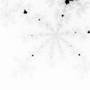

Assignment 5
============

**Due: February 27, 2023 11:59 PM US Central Time**. Push to GitHub to submit the assignment.

This assignment will allow you to get more experience using threads to parallelize an expensive computation (this assignment is based on an assignment here: http://www3.nd.edu/~cpoellab/teaching/cse30341/project3.html).

To study concurrency, we need tasks that are computationally expensive. This assignment uses mandelbrot sets, which are computationally expensive to generate. You can learn more about mandelbrot sets at http://www.math.utah.edu/~pa/math/mandelbrot/mandelbrot.html. The set is interesting both mathematically and aesthetically because it has an infinitely recursive structure. You can zoom into any part and find swirls, spirals, snowflakes, and other fun structures, as long as you are willing to do enough computation. For example, here are three images starting from the entire set and zooming in (you will have to compile the code available in the repository):

```
./mandel -x -0.5 -y 0 -s 2
```


```
./mandel -x -0.5 -y -0.5 -s 0.5
```


```
./mandel -x -0.5 -y -0.5 -s 0.25
```


## The provided code

If you run the program with no arguments, then it generates a default image and writes it to `mandel.bmp`. Use `display mandel.bmp` to see the output. You can see all of the command line options with `mandel -h`, and use them to override the defaults. (Each of the images on this page is labelled with the command that produces it.) This program uses the *escape time algorithm*. For each pixel in the image, it starts with the x and y position, and then computes a recurrence relation until it exceeds a fixed value or runs for `max` iterations.

```C
    int iterations_at_point( double x, double y, int max )
    {
        double x0 = x;
        double y0 = y;
        int iter = 0;

        while( (x*x + y*y <= 4) && iter < max ) {

            double xt = x*x - y*y + x0;
            double yt = 2*x*y + y0;

            x = xt;
            y = yt;

            iter++;
        }

        return iter;
    }
```

The `max` value controls the amount of work done by the algorithm. If we
increase `max`, then we can see much more detail in the set, but it may
take much longer to compute. Generally speaking, you need to turn the
`max` value higher as you zoom in. For example, here is the same area in
the set computed with four different values of `max`:

```
./mandel -x 0.286932 -y 0.014287 -s .0005 -m 50
```


```
./mandel -x 0.286932 -y 0.014287 -s .0005  -m 100
```


 ```
./mandel -x 0.286932 -y 0.014287 -s .0005 m 500
 ```
 
 
 ```
./mandel -x 0.286932 -y 0.014287 -s .0005 m 1000
 ```
 

## Assigning Color

Then, the pixel is assigned a color according to the number of
iterations completed. An easy color scheme is to assign a gray value
proportional to the number of iterations, but others are possible. Here
are a few color variations of the same configuration, generated by

```
./mandel -x -.38 -y -.665 -s .05 -m 1000
```





## Parallel Programming

It can take a long time to compute a Mandelbrot image. The
larger the image, the closer it is to the origin, and the higher the
`max` value, the longer it will take. Suppose that you want to create
high resolution Mandelbrot images, and it is going to take a
long time. Your job is to speed up the process by using multiple threads.

## Step One: Find a Good Image

Explore the Mandelbrot space a little bit and find an interesting area.
The more you zoom in, the more interesting it gets, so try to get `-s`
down to 0.0001 or smaller. Play around with `-m` to get the right amount
of detail. Find a configuration that takes about 5 seconds to generate.
If you find an image that you like, but it only takes a second or two to
create, then increase the size of the image using `-W` and `-H`, which
will definitely make it run longer.

## Step Two: Multiple Threads

Modify `mandel.c` to use an arbitrary number of threads to compute the
image. Each thread should compute a completely separate band of the
image. For example, if you specify three threads and the image is 500
pixels high, then thread 0 should work on lines 0-165, thread 1 should
work on lines 166-331, and thread 2 should work on lines 332-499. Add a
new command line argument `-n` to allow the user to specify the number
of threads. If `-n` is not given, assume a default of one thread. Your
modified version of `mandel` should work correctly for any arbitrary
number of threads and image configuration.

Note that each thread is going to work on a completely different subset
of the data, so you do not have to worry about synchronization and race
conditions.

Double check that your modified `mandel` produces the same output as the
original.

## Step Three: Evaluation

Write a short report, README.md, and push it into your repository in the report/ folder. 
This report should explain the following items:

-   In your own words, briefly explain the purpose of the experiment
    and the experimental setup. Be sure to clearly state on which
    machine you ran the experiments, and exactly what your command line
    arguments were, so that we can reproduce your work in case of
    any confusion.

-   For the following two configurations, measure and graph the
    execution time of your  multithreaded `mandel` using 1, 2, 3, 4, 5,
    10, 50, and 100 threads. The execution time of these experiments may 
    be upset by other things going on in the machine. So, repeat each
    measurement five times, and use the average time achieved.

    - **A:** mandel -x -.5 -y .5 -s 1 -m 2000
    - **B:** mandel -x 0.2869325 -y 0.0142905 -s .000001 -W 1024 -H
        1024 -m 1000

    To measure the execution times, use [time](https://stackoverflow.com/questions/556405/what-do-real-user-and-sys-mean-in-the-output-of-time) command. 
    Make sure that you run all your experiments in the virtual machine with **more than one core**, e.g., 3 or 4 cores.
    
-   Explain the shape of the two curves. What is the minimum number of 
    threads that each of the two configurations requires to generate an 
    image such that adding more threads does not sustantially reduce the 
    execution time? Why do curves A and B have a different shape?
	
## Hints

`mandel.c` uses the standard `getopt` routine to process command line
arguments. To add the `-n` argument, you will need to add `n:` to the
third argument of `getopt`, add an additional case statement underneath,
and update the help text.

Where `main` previously made one call to `compute_image`, you will need
to modify it to create N threads with `pthread_create`, assign each to
create one slice of the image, and then wait for each to complete with
`pthread_join`.

`pthread_create` requires that each thread begin executing a function
that only takes one pointer argument. Unfortunately, `compute_image`
takes a whole bunch of arguments. What you will need to do is modify
`create_image` from this:

```
    void compute_image( struct bitmap *b, double xmin, double xmax, double ymin, 
    double ymax, double itermax );
```
to this:
   
```
   void * compute_image( struct thread_args *args )
```

where `thread_args` contains everything that you want to pass to
`compute_image`. Now, for each thread, allocate a `thread_args`
structure and pass it as the fourth argument to `pthread_create`, which
will turn around and pass it to `compute_image`.
Pthreads requires `compute_image` to return a `void *`, but since it
doesn't actually need to return any data, just return `NULL`; at the end of
the function.

## Tasks

* Add a new command line argument `-n` to `mandel.c` to allow the user to specify the number of threads. If -n is not given, assume a default of one thread. 
* Modify the existing `compute_image` function in `mandel.c` so that it takes a single pointer to a `struct thread_args`  (as described above). Use this new `compute_image` function as the function pointer argument to `pthread_create` for your multi-threaded implementation.
* Evenly divide the rows of the image between the threads. If the number of rows is not evenly divisible by the number of threads, give one thread more rows than the rest (and give the rest an equal number of rows).
* Measure and graph the execution times for the two experiemental setups described above.
* In the report/README.md file, explain the shape of the two curves, state the minimum number of threads required for doing computations without the substantial decrease of the computation time, and explain why curves A and B have a different shape.

## Evaluation

Your assignment will be graded according to the following criteria:

- **19 points** for each of the five tasks above.
- **5 points** for coding style, including 1) brief comments on complex portions of code, 2) consistent formatting, and 3) consistent and proper indentation.
